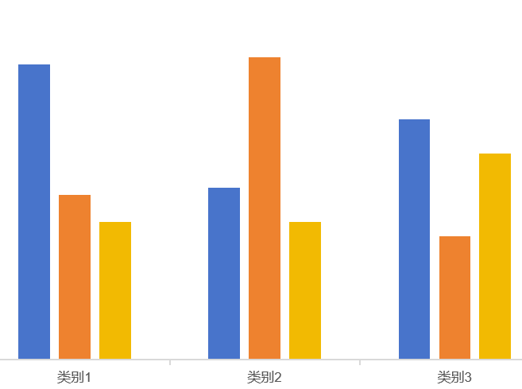

### 第一次作业

##### A题

简单的for循环


##### B题

2n的逆等差数列和2n+1的逆等差数列可以拼接成一个新的逆等差数列


##### C题

题目结构是0101的形式，可以暴力枚举，直接暴力枚举会导致时间或者空间上的爆炸。所以方法是分成两个组$2^{15}$和$2^{15}$时间上就够了。

后面要考虑的方法是如何将这两个组合并起来，如果单纯靠两层for循环合并，时间复杂度与前面无异，需要使用一些策略，从一组出发，检查D-weight是否在另一个组来做，只需要一层for循环。


##### D题


### 第二次作业

##### A题

使用PyPy提交，时间复杂度可以降到$n^2$

##### B题

多步决策问题可以使用动态规划，写出OPT转换方程。

##### C题

- 也是一个多步决策问题

- 但是DP要求问题不具有后效性，如果简单考虑，蚂蚁返回的路径依赖于其前往的路径，所以具有后效性。

- **要将其转化为不具有后效性的问题（就要增加DP的维度）**，这里转化成两只蚂蚁同时从起点出发到达终点，并且互相不能走对方的路径。求最大化两条路径的和。

- 优化方程:
$ opt[x_1][y_1][x_2]=max \begin{cases}opt[x_1-1][y_1][x_2] \\opt[x_1-1][y_1][x_2-1] \\opt[x_1][y_1-1][x_2] \\opt[x_1][y_1-1][x_2-1] \end{cases} $

- 其中有条件$x_1\neq x_2$。因为两只蚂蚁是同步进行前进的所以第二只蚂蚁的纵坐标可以通过$y_2=x_1+y_1-x_2$计算出来，所以只需要三维的DP


Python读取数据忽略空格

```python
food = list(map(int,input().split()))  #注意split里面不用加' '
```


##### D题

可以使用动态规划查看机器能否到达这个点


### 第三次作业

##### A题

是一个简单的数学问题，只需要找到间隔最大的M-1个occupied stall，注意处理特殊情况（比如当M=1时）

##### B题

也是贪心的想法，找到最长的传播天数，最长传播天数在边缘的牛群和中间的牛群计算方法不一样。得到最长传播天数之后，考虑每个群体在此传播天数下，最少需要多少只牛。考虑边界情况。

> [!NOTE]
>
> Python和C++同一个算法，但是C++能通过，Python却有四个样例过不去，匪夷所思


##### C题

如果使用递归找连续的牌时间和空间上过不去。

仔细思考，如果牌数是一个峰值，则最少的出牌次数是这个峰的最大值。无论单调、还是先增后减（类别1，2）。而如果是一个谷，则需将这个牌分成两部分，每部分出牌的次数等于每部分的最大值（类别3）。



检测谷的方法就是判断`a[i+1]`比`a[i]`大的话，答案就新增`a[i+1]-a[i]`，否则不做操作。

##### D题

每次加油都加目前能到达区间内最多的。

- 维护一个可到达加油站的列表，每次加油都取最大的加油站（取出后要删除，防止下次再次加油）
- 每次加油之后，会更新最远可到达的地方，同时新增可到达的加油站列表
- 终止条件为可到达的地方是目的地


```Runtime error (NZEC)```似乎是陷入死循环

```python
# 报错
while(end>0 and len(Available_fuel_stop)):

# 修改后
while((end>0) and (len(Available_fuel_stop)>0)):
```


### 第四次作业

##### A题

简单的判断

##### B题

整数规划问题，虽然可以用求解整数规划的方法解决（分支界定法等），但这样会很复杂，而且时间可能过不去，要考虑其他方法。对于这种简单的约束可以考虑动态规划。

**动态规划，以需要满足的条件为index，以需要优化的值作为value**

$dp[V]=min(dp[V-c_i]\dots)+1$

##### C题

同B题，本题目是01规划，可以写出规划的目标函数和限制条件。但也可以用动态规划。$dp$代表第$n$天制作$m$个产品的最低消耗。

$dp[n][m]=min(\{dp[n-1][m-m_i]+c_i|i=1,\cdots,p\},dp[n-1][m])$

##### D题

https://www.luogu.com.cn/problem/solution/P3980
